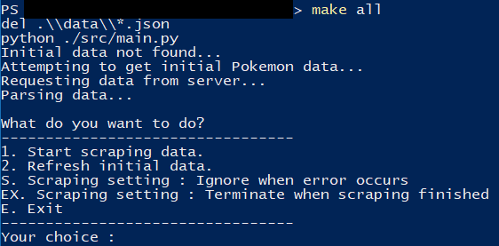
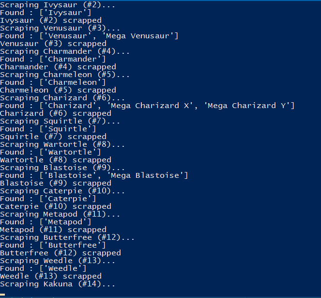

<h1 align="center">
  <br>
  Pokédex Scraper
  <br>
  <br>
</h1>

### Description
Program ini melakukan scraping data Pokémon yang berasal dari [Bulbapedia](https://bulbapedia.bulbagarden.net). Program dibuat dalam bahasa Python 3.

### Specifications

1. Lakukan data scraping dari sebuah laman web untuk memeroleh data atau informasi tertentu __TANPA MENGGUNAKAN API__

2. Daftarkan judul topik yang akan dijadikan bahan data scraping pada spreadsheet berikut: [Topik Data Scraping](http://bit.ly/TopikDataScraping). Usahakan agar tidak ada peserta dengan topik yang sama. Akses edit ke spreadsheet akan ditutup tanggal 10 Mei 2018 pukul 20.00 WIB

3. Dalam mengerjakan tugas 1, calon warga basdat terlebih dahulu melakukan fork project github pada link berikut: https://github.com/wargabasdat/Seleksi-2018/tree/master/Tugas1. Sebelum batas waktu pengumpulan berakhir, calon warga basdat harus sudah melakukan pull request dengan nama ```TUGAS_SELEKSI_1_[NIM]```

4. Pada repository tersebut, calon warga basdat harus mengumpulkan file script dan json hasil data scraping. Repository terdiri dari folder src dan data dimana folder src berisi file script/kode yang __WELL DOCUMENTED dan CLEAN CODE__ sedangkan folder data berisi file json hasil scraper.

5. Peserta juga diminta untuk membuat Makefile sesuai template yang disediakan, sehingga program dengan gampang di-_build_, di-_run_, dan di-_clean_

``` Makefile
all: clean build run

clean: # remove data and binary folder

build: # compile to binary (if you use interpreter, then do not implement it)

run: # run your binary

```

6. Deadline pengumpulan tugas adalah __15 Mei 2018 Pukul 23.59__

7. Tugas 1 akan didemokan oleh masing-masing calon warga basdat

8. Demo tugas mencakup keseluruhan proses data scraping hingga memeroleh data sesuai dengan yang dikumpulkan pada Tugas 1

9. Hasil data scraping ini nantinya akan digunakan sebagai bahan tugas analisis dan visualisasi data

10. Sebagai referensi untuk mengenal data scraping, asisten menyediakan dokumen "Short Guidance To Data Scraping" yang dapat diakses pada link berikut: [Data Scraping Guidance](http://bit.ly/DataScrapingGuidance)

11. Tambahkan juga gitignore pada file atau folder yang tidak perlu di upload, __NB : BINARY TIDAK DIUPLOAD__

12. JSON harus dinormalisasi dan harus di-_preprocessing_
```
Preprocessing contohnya :
- Cleaning
- Parsing
- Transformation
- dan lainnya
```

13. Berikan README yang __WELL DOCUMENTED__ dengan cara __override__ file README.md ini. README harus memuat minimal konten :
```
- Description
- Specification
- How to use
- JSON Structure
- Screenshot program (di-upload pada folder screenshots, di-upload file image nya, dan ditampilkan di dalam README)
- Reference (Library used, etc)
- Author
```

### How To Use
1. Pastikan Python 3 sudah terpasang di komputer. Jika belum, silahkan lihat [ini](https://www.python.org/) untuk memasang Python.
2. Jalankan ```make build``` untuk memasang _dependencies_ yang diperlukan program. Perintah ini cukup dijalankan sekali
3. Jalankan ```make run```. Program akan mengambil data awal ketika pertama kali dijalankan.
4. Masukkan angka pilihan menu untuk berinteraksi dengan program.

* Untuk pengguna dengan OS Linux, ```make clean``` tidak akan berjalan dengan sempurna. Gunakan ```rm ./data/*.json``` untuk mengganti perintah tersebut.

### JSON Structure
Data hasil tersimpan di ```main_data.json``` dengan format seperti ini :
```
[
  ...
  {
    "no": 9,
    "name": "Blastoise",
    "made_in": "Generation I",
    "type": "Water",
    "ability": [
      "Torrent",
      "Rain Dish"
    ],
    "weight": "85.5 kg",
    "stats": {
      "hp": "79",
      "atk": "83",
      "def": "100",
      "spatk": "85",
      "spdef": "105",
      "spe": "78"
    }
  },
  {
    "no": 9,
    "name": "Mega Blastoise",
    "made_in": "Generation VI",
    "type": "Unknown",
    "ability": [
      "Mega Launcher"
    ],
    "weight": "101.1 kg",
    "stats": {
      "hp": "79",
      "atk": "103",
      "def": "120",
      "spatk": "135",
      "spdef": "115",
      "spe": "78"
    }
  }
...
]
```

Program akan mengambil pula _type chart_ dan menyimpannya dalam ```type_chart.json``` dengan format seperti ini :
```
{
  "Normal": {
    "Normal": 1,
    "Fighting": 1,
    "Flying": 1,
    "Poison": 1,
    "Ground": 1,
    "Rock": 0.5,
    "Bug": 1,
    "Ghost": 0,
    "Steel": 0.5,
    "Fire": 1,
    "Water": 1,
    "Grass": 1,
    "Electric": 1,
    "Psychic": 1,
    "Ice": 1,
    "Dragon": 1,
    "Dark": 1,
    "Fairy": 1
  }
  ...
}
```

### Screenshots



### Reference
  Libraries:
  * [BeautifulSoup](https://crummy.com/software/BeautifulSoup/bs4/doc/)

  Data Source:
  * [Bulbapedia](https://bulbapedia.bulbagarden.net)

### Author
  * Nama : Antonio Setya
  * Email : antonio_setya@hotmail.com

### Additional Notes
  Data yang disediakan dalam program ini berada dibawah lisensi _Creative Commons_. Anda dapat menggunakan dan menyebarluaskan data ini secara bebas untuk keperluan non-komersil. Untuk lebih jelas, silahkan lihat [link](https://creativecommons.org/licenses/by-nc-sa/2.5/deed.id) ini.

  _Data provided by this program is licensed under the Creative Commons license. You can use and share this data for non-commercial purposes. For more info, visit_ [this link](https://creativecommons.org/licenses/by-nc-sa/2.5/)
